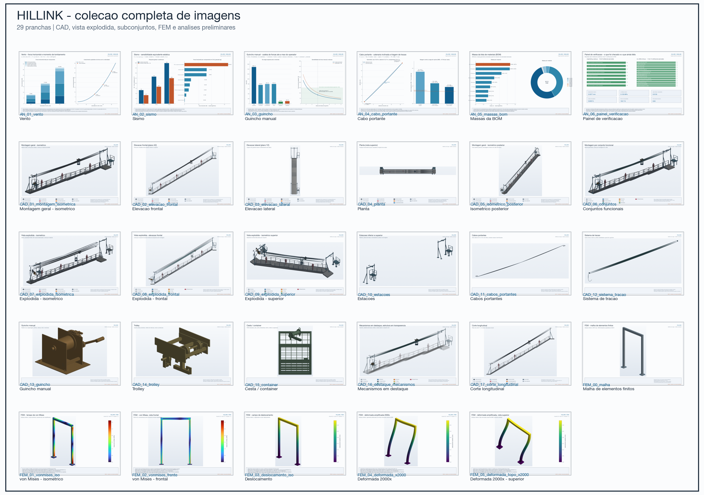
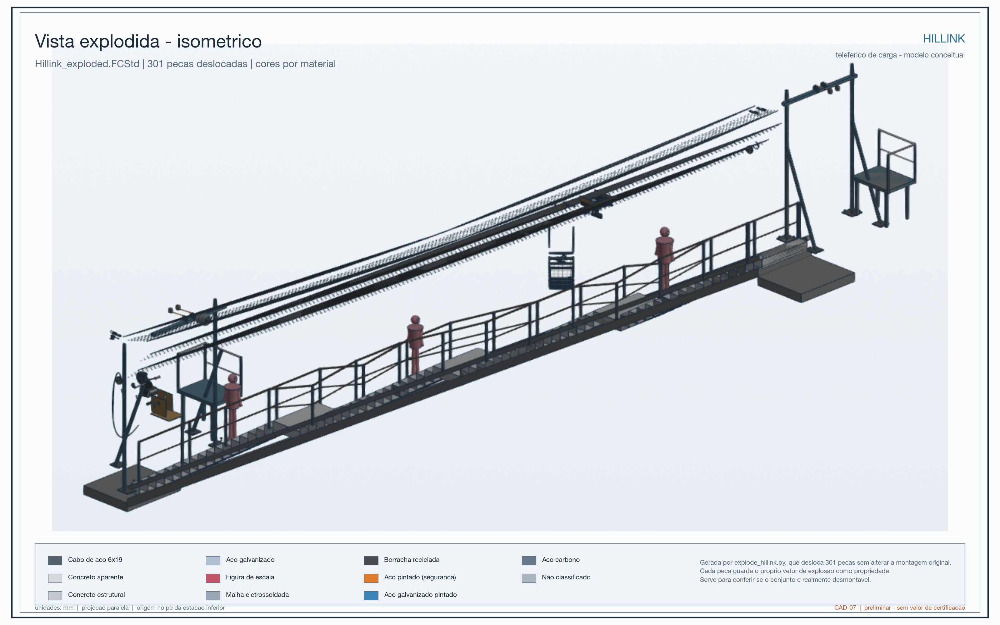
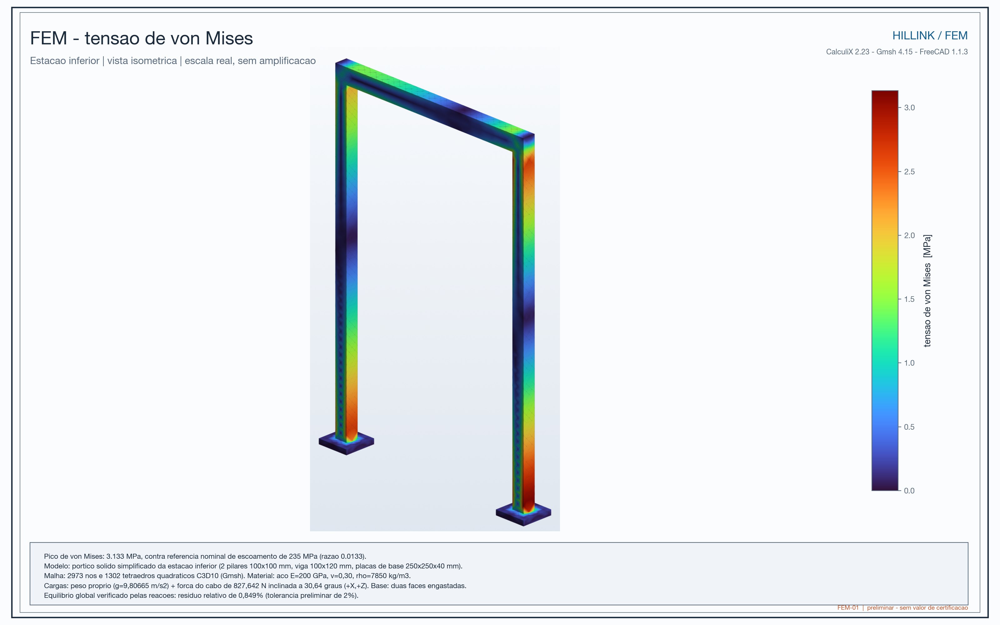

# Arquivos

## **[Abrir o índice de arquivos](arquivos.md)**

| Categoria | Conteúdo |
| --- | --- |
| [Todos os arquivos](arquivos.md) | renders, modelos, análises e vídeos |
| [Modelo em AR](assets/models/Hillink_modelo.usdz) | abre no iPhone e iPad |
| [Modelo CAD](assets/models/Hillink.step) | STEP, 13 MB |
| [Lista de materiais](assets/models/Hillink_BOM.csv) | BOM em CSV |
| [Artigo completo](assets/relatorio.pdf) | PDF, 7,2 MB |

### Pranchas técnicas

São 30 pranchas: 17 de CAD, 6 de FEM e 6 de análises.

