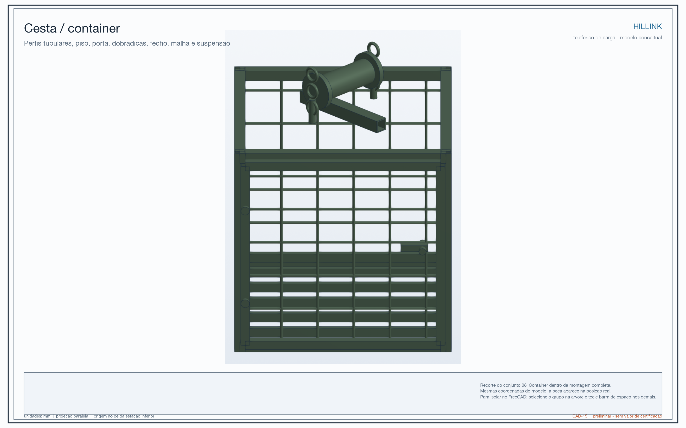
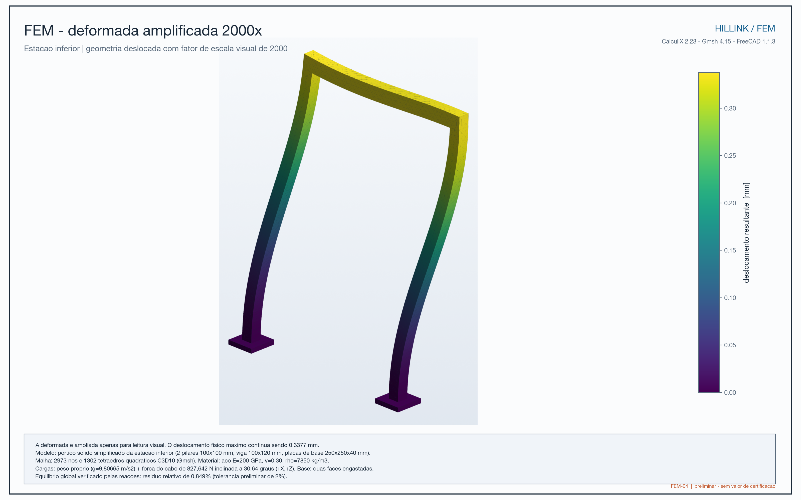

# Exemplos

> **How to read this page:** The examples use the reference-case numbers to explain the concept. They must not be used on their own to decide what may be placed on a real installation.

## Example 1: weekly groceries

Imagine a family buying 10 kg of food at the point where a motorcycle or vehicle can reach. Today, someone may have to carry those groceries up the stairs, possibly in more than one trip.

With Hillink, the load could be placed in the container at the lower station. The operator would close the container, operate the winch, and guide the trolley to the upper station. The person would still need to walk and carry the groceries for the final part, but would not need to carry the full weight across the entire steep route.

The model was studied with 46.1 kg of contents in addition to the 38.3 kg container. Therefore, **10 kg of groceries is below the reference load used in the simulation**, but this does not mean that 10 kg is automatically approved: the real operating limit depends on testing, balance, container design, brake performance, wind, and local rules.

## Example 2: cooking-gas cylinder

A gas cylinder is a useful example because it is heavy, bulky, and difficult to carry on a stairway. Hillink is intended to transport loads of this kind in a dedicated container, so that a person does not have to carry the cylinder on their body.

In practice, the cylinder would need to be secured so it could not tip or shift. The station would need to allow loading and unloading without lifting the object above waist height. The project would also need inspection rules, impact protection, container compatibility, and authorization from the responsible authorities.

The project did not demonstrate through testing that a gas cylinder can be transported safely. This example only shows why this type of load is part of the problem the system is intended to reduce.

## Example 3: water and construction materials

A household may need to move water containers or small amounts of cement, timber, and tools. Instead of dividing the load among several people, the system could move one batch at a time.

The expected benefit is not to make the mountain disappear. It is to reduce the number of trips with weight, the time spent on the difficult segment, and physical exhaustion. To verify whether this actually happens, a pilot should record:

- how many manual trips were made before the pilot;
- how many kilograms were carried per week;
- how long each trip took;
- how much was paid for delivery or assistance;
- how many incidents, near-falls, or complaints occurred;
- how residents rated the effort before and after.

## Example 4: what does 82 N mean?

The model estimates approximately **82 N of hand force during movement** and **103 N at start-up**. As a simple explanation, this is approximately equivalent to the weight-force of 8.4 kgf and 10.5 kgf.

This does not mean that the operator will hold exactly 8.4 kg in the air. The force depends on crank position and friction; it is only an approximate way to understand the calculated effort. An operator may be able to turn the crank but still become tired after many cycles. Ergonomics, rest periods, speed, and teamwork therefore need to be tested with real people.

## Example 5: why wind matters so much

The preliminary calculation estimates about **2.9 kN** of total force at 12 m/s and about **7.9 kN** at 20 m/s. The difference is large because wind loading grows approximately with the square of wind speed.

As an analogy, pushing a door with a light breeze is different from pushing it with a strong gust. In Hillink, wind can push the structure, swing the container, change cable forces, and make the operator's work more difficult.

The real system would therefore need a wind limit, an anemometer or observation procedure, and a clear rule for stopping operation.

## Example 6: why “the cable can take it” is not the end of the analysis

In the screening calculation, the maximum carrier-cable tension reached approximately **9.85 kN per cable**, while the registered minimum breaking load was **87 kN per cable**. The division gives approximately 8.8.

The correct reading is: **in the simplified model, the calculated tension was below the registered breaking load**. The incorrect reading would be: “the system is approved with a factor of 8.8.” Between those two statements are terminations, pulleys, bends, fatigue, corrosion, shock, installation, anchorages, and code requirements. Those details can change the result.

## Example 7: what the FEM analysis actually showed

The FEM submodel represented a simplified lower station with two ideally fixed bases and an inclined operational load. The maximum result was **0.338 mm of displacement** and **3.13 MPa of von Mises stress**.

In educational terms: the idealized structure moved very little under that load. But this is like testing a structural model with perfect supports: it helps check the behavior of the example, but it does not guarantee that real soil, welds, bolts, and foundations will behave the same way.

## What can Hillink carry according to the model?

The most honest formulation is:

> The preliminary reference case was calculated for approximately 84.4 kg of cargo in the container, over a span of 21.05 m horizontally and 12.47 m of elevation gain, with an estimated hand force of 82 N during movement and 103 N at start-up. These values describe the studied case; they are not certified limits and cannot be transferred automatically to another route.

The model did not study passengers. It also does not authorize transporting hazardous, fragile, unstable, or larger loads without a specific design for them.

## What responsible operation might look like

A pilot operation should work approximately as follows:

- An operator checks the cables, pulleys, container, brake, visible anchorages, and route.
- The load is weighed and kept below the approved limit for that pilot.
- The load is distributed and secured so it cannot tip.
- The stairway is cleared and people are warned during movement.
- The operator moves the trolley slowly, without sudden jerks.
- When the crank is released, the locking mechanism must prevent uncontrolled rollback.
- The load is unloaded at the station, and any noise, jamming, wear, or incident is recorded.
- The system is taken out of service if wind exceeds the limit, damage is found, or there is any doubt about safety.

This is a description of intended operation, not a ready-to-use manual. A real manual would need to be written and approved together with the design, tests, and local authorities.

## What the pilot would need to prove

The pilot should not measure only whether the trolley moves. It should verify that the solution improves daily life without creating new risks:

- fewer manual trips;
- less transport time and cost;
- less weight carried on the body;
- lower exhaustion and dependence on assistance;
- no obstruction or conflict with pedestrians;
- reliable brake and uncontrolled-descent protection;
- stable container behavior with different loads;
- acceptable behavior in wind and rain within defined limits;
- maintenance that the community can actually perform.

## In summary

Hillink is more like a small mechanical bridge for cargo than a passenger cable car. The concept makes sense when the main problem is the last segment between the road and the home. It may reduce human effort, but it will be a real solution only if the route is suitable, anchorages are verified, limits are respected, and the community can operate and maintain the system.
