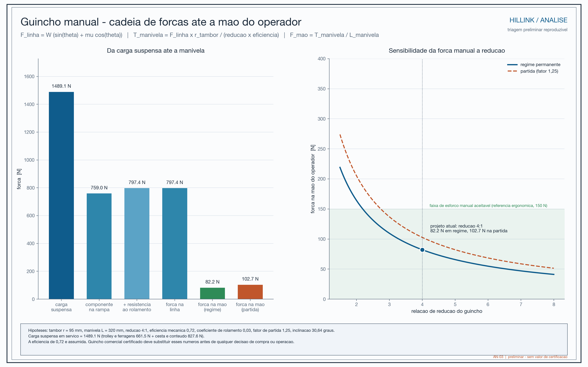
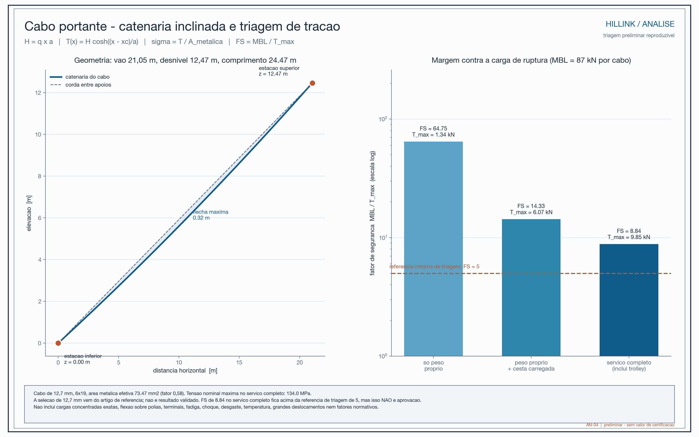
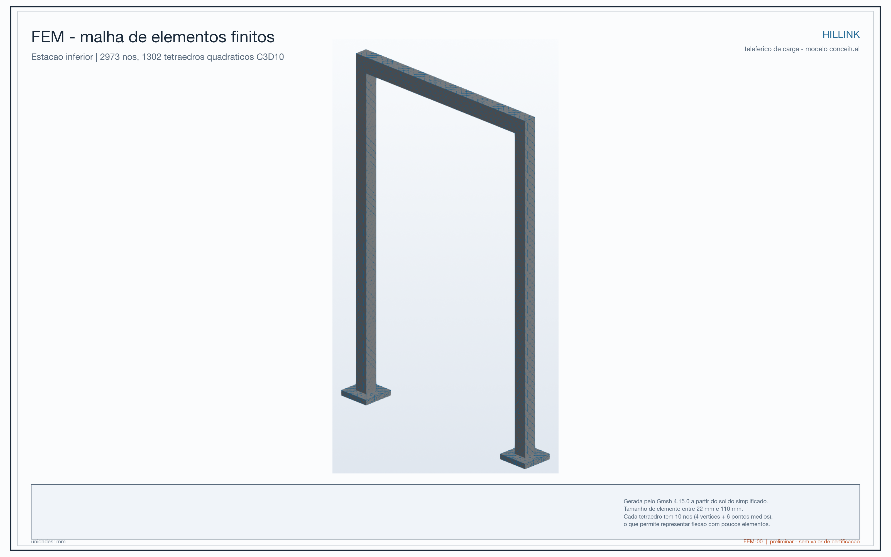

# Resultados

> **Important notice:** The numbers below are preliminary model results. They help explain the idea, compare scenarios, and identify what must be verified. They are not a manufacturing authorization, a safety certification, or a guaranteed capacity for any installation.

## One-sentence summary

The study indicates that the concept may be mechanically plausible for a short span and a reference load, but it still depends on decisive checks of anchorages, foundations, real cables, fatigue, wind, seismic response, uncontrolled descent protection, and field operation.

## What each analysis means

### 1. Mass and service load

The model uses an empty container of **38.3 kg** and **46.1 kg of contents**, for a total container load of about **84.4 kg**. Including the trolley and hardware, the moving assembly considered in service weighs about **1,489 N**, equivalent to roughly 152 kg of mass.

In simple terms: the studied case represents something like a heavy basket of groceries, water, or materials, not a passenger cabin. The very large mass that appears in the model inventory comes mainly from the floor and stair-support structure; that value must be confirmed on site because it strongly affects the seismic calculations.

### 2. Manual winch

For the 30.6° inclination, the model estimates:

| Situation | Approximate hand force |
| --- | --- |
| Continuous movement | 82 N, about 8.4 kgf |
| Starting movement | 103 N, about 10.5 kgf |

This means that the operator would need to apply a force similar to pulling an 8 to 10 kgf load in the direction of the crank, under the assumed drum radius, reduction ratio, and efficiency. It is not a validated ergonomic measurement: real friction, wear, slope, wind, misalignment, and acceleration may increase the effort.

### 3. Carrier cables

In the simplified analytical check, each carrier cable reaches an approximate maximum tension of **9.85 kN** in the scenario that includes the estimated trolley self-weight. Compared with the registered minimum breaking load of **87 kN per cable**, this gives a ratio of approximately **8.8 to 1**.

The correct interpretation is preliminary screening, not a final safety factor. The calculation does not adequately cover terminations, pulleys, repeated bending, fatigue, shock, wear, temperature, corrosion, real concentrated loads, or code-required factors. The 12.7 mm cable selection also came from a commercial reference and was not validated by a supplier or a test.

### 4. Wind

Because wind loading grows approximately with the square of wind speed, increasing the wind from 12 to 20 m/s does not increase the force by only a small amount: the calculated total force rises from about **2.9 kN** to **7.9 kN**. At 20.8 m/s, the screening case reaches **8.6 kN** and about **54.2 kN·m** of base moment.

These values use preliminary projected areas and drag coefficients. Real wind depends on gusts, height, structure shape, direction, topography, and route exposure. The suspended container may also swing.

### 5. Earthquake sensitivity

The seismic cases were equivalent-static sensitivity checks. They show how the forces could grow if a given acceleration were applied to the modeled mass:

| Acceleration scenario | Calculated base shear | Calculated base moment |
| --- | --- | --- |
| 0.20 g | 87.1 kN | 546.8 kN·m |
| 0.39 g | 174.1 kN | 1,093.6 kN·m |
| 1.18 g | 522.4 kN | 3,280.7 kN·m |

This is not a prediction of how Hillink would behave in an earthquake. It does not include vibration modes, a complete response spectrum, cable-structure interaction, ductility, soil, foundations, load combinations, or connection details. It indicates that the site and anchorages need serious study.

### 6. Lower-station FEM

A simplified solid submodel of the lower station, with ideally fixed bases, self-weight, and an 827.6 N operational load, returned:

- maximum displacement: **0.338 mm**;
- maximum von Mises stress: **3.13 MPa**;
- global equilibrium: passed within the recorded 2% tolerance.

In simple terms: within that simplified shape and those support conditions, the structure moved very little and the solver closed the example's equilibrium. This validates the calculation chain for the example, not the real station. The model does not reproduce actual tubes, welds, bolts, contact, foundations, anchorages, or mesh-convergence studies.

## Limitations that change the interpretation

- The CAD is conceptual and does not replace fabrication drawings.
- Masses, material grades, and cable selection still need confirmation.
- The exact site, soil, foundation, and anchorage type are not defined with design data.
- Wind is a screening calculation using approximate areas and coefficients.
- Seismic loading is an equivalent-static sensitivity check, not a complete seismic analysis.
- The FEM analysis uses an idealized solid frame and does not represent all real joints and parts.
- Fatigue, corrosion, wear, inspection, transportation, assembly, and long-term maintenance were not validated.
- An uncontrolled trolley is still an independent safety problem: a haulage-cable break or ratchet failure can create meaningful speed and energy. Structural sizing alone does not solve that risk.
- There is an important geometry issue: the cable-to-pulley diameter ratio appears as 15.75, while the adopted criterion indicated 18.
- The estimated first natural frequency, 0.857 Hz, suggests sensitivity to gusts, but the mode may belong to the cable in the idealized topology and needs reassessment.

## Possible improvements

- Confirm the route and perform topographic and geotechnical surveys.
- Replace assumptions with supplier data for materials, cables, pulleys, brakes, and anchorages.
- Correct or justify the cable-to-pulley ratio.
- Design and test an independent uncontrolled-descent protection system.
- Analyze foundations, connections, welds, bolts, fatigue, corrosion, and impact.
- Redo wind and seismic analysis with site data and code load combinations.
- Study vertical clearance, container swing, and pedestrian interference.
- Establish load, speed, wind, and stopping limits.
- Test the winch with real loads and observe human effort over a complete cycle.
- Begin with an instrumented pilot and compare before-and-after measurements.

## Final conclusion

Hillink has not proved that any hillside can receive a cargo ropeway. What it has done is turn an everyday problem—carrying essential goods on stairs and difficult terrain—into a measurable mechanical proposal. The concept is promising enough to investigate for short spans, but an installation decision requires a new stage of engineering, safety, and community validation.
