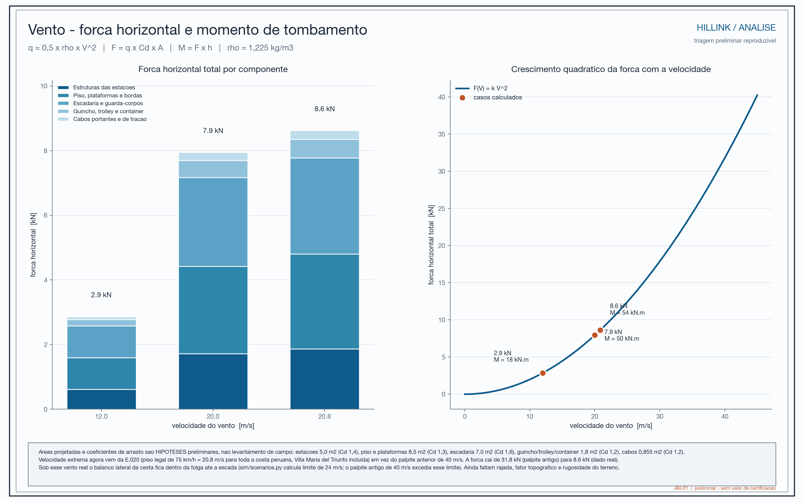
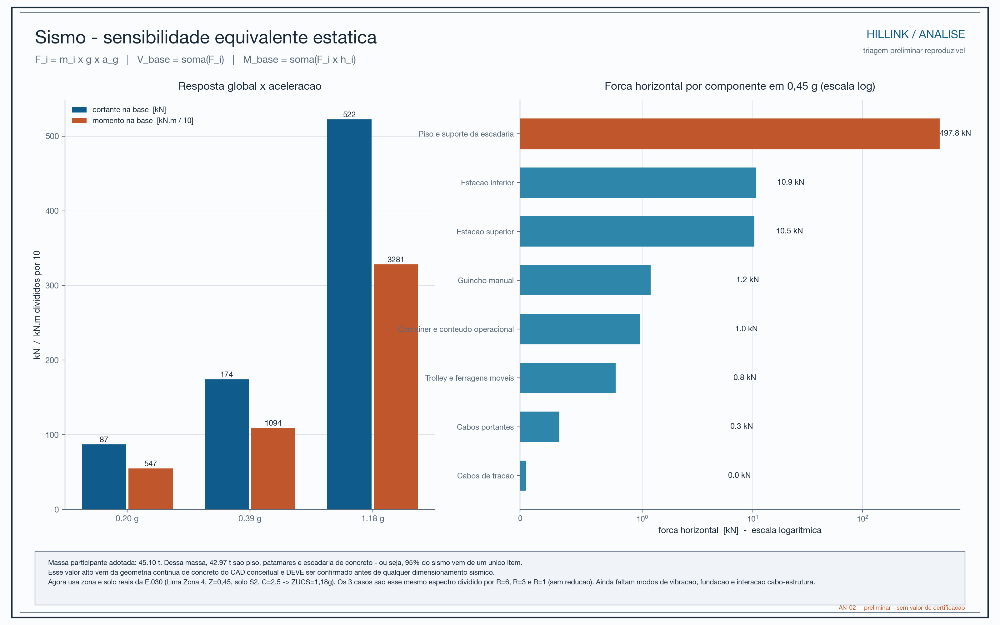

# Vídeos

Vento

| Categoria| Valor|
| --- | --- |
| **Vento** — E.020 | 20,8 m/s, minimum estabilished |
| **Sismo** — E.030 |  Zone 4 (Lima - Peru), soil type S2 |

<video src="../assets/video/S4_vento.mp4" controls muted loop playsinline
       style="width:100%;border-radius:8px;margin:1.2em 0" controls></video>

