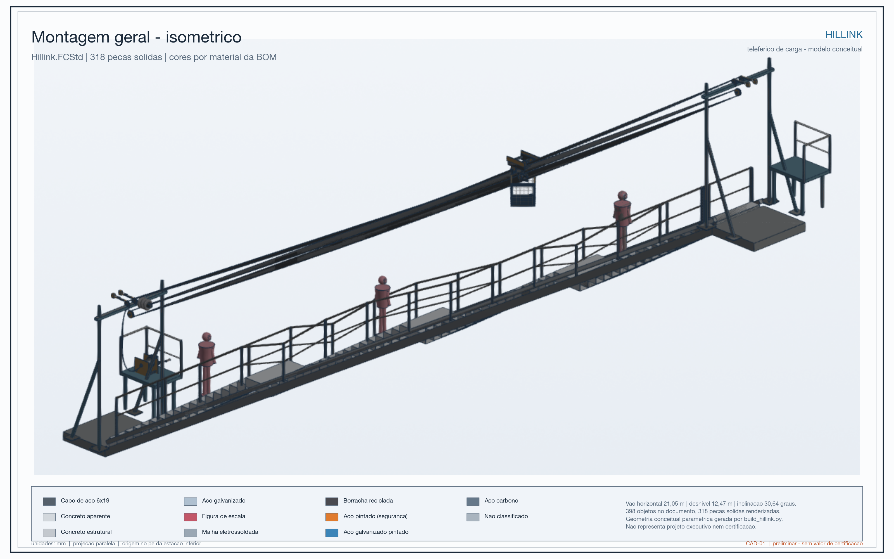
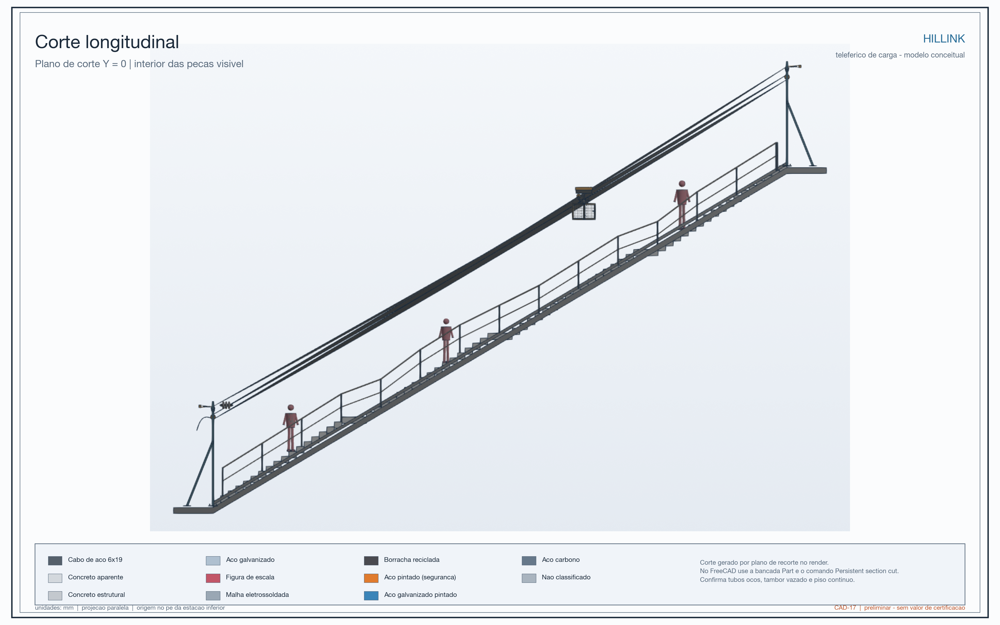
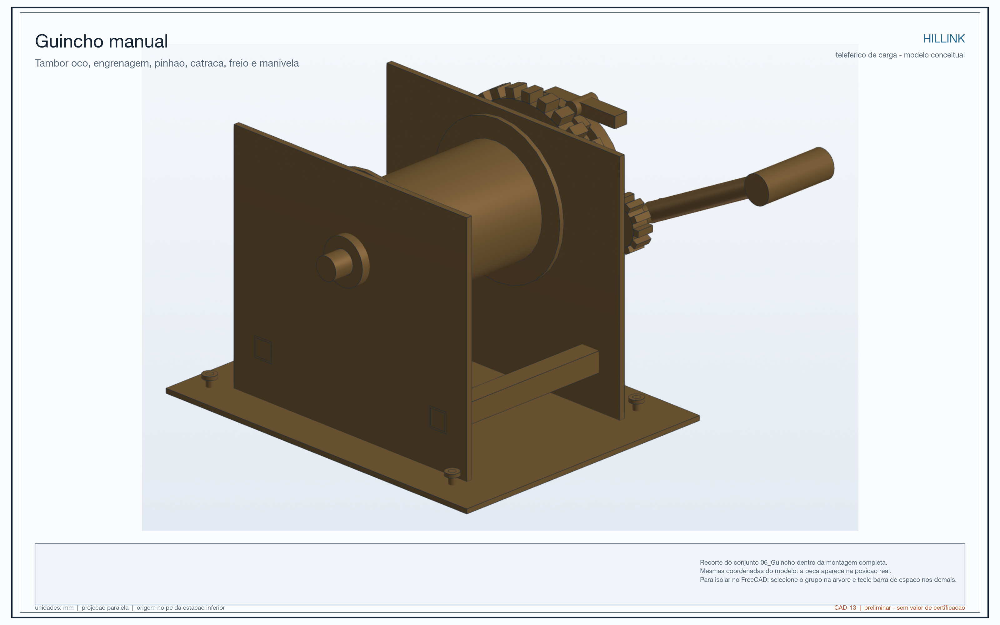

# Visao-geral

> **Important notice:** this page presents a concept and preliminary engineering results. Hillink is not a certified system, has not been released for fabrication, and must not be installed or operated without detailed design, site verification, authorization, and supervision by qualified professionals.

## What is Hillink?

Hillink is a proposal for a mechanical cargo transport system for hillside communities where roads and vehicles cannot easily reach homes. The idea is to move essential goods along a steep route using a suspended trolley, cables, and a manual winch.

It is designed for **cargo, not passengers**: groceries, water, cooking gas, medicine, food, and small construction materials. The system does not depend on electricity and is arranged so that the stairway can remain available for pedestrians.

The project starts with a simple problem: when someone has to climb many stairs while carrying weight, the route costs more time, effort, money, and safety. The project calls this additional burden the **Geography Tax**.

## How it would work

- The load is placed in a container at the lower station.
- A trolley with wheels travels along two carrier cables above the route.
- A separate haulage cable pulls the trolley.
- An operator turns a manual winch with a self-locking mechanism.
- At the upper station, the cargo is unloaded and the trolley can return.

The haulage cable is not the same cable that supports the load. This separation is one of the concept's safety ideas: if the pulling cable has a problem, the load remains supported by the carrier cables instead of depending on one line for both support and movement.

## Scale of the studied model

| Characteristic | Model value |
| --- | --- |
| Horizontal span | 21.05 m |
| Elevation gain | 12.47 m |
| Inclination | 30.6° |
| Carrier cables | 2 |
| Nominal carrier cable diameter | 12.7 mm |
| Empty container | 38.3 kg |
| Reference contents | 46.1 kg |
| Service weight of the moving assembly | about 1,489 N, equivalent to approximately 152 kg of mass, including trolley and cargo |

These values describe the analyzed model, not a universal Hillink capacity. A real installation would have to be recalculated for its terrain, length, supports, soil, wind, cable type, and actual load.

## Why manual and non-electric?

The project was designed for places where an electric solution may be expensive, difficult to maintain, or dependent on an unstable grid. The manual winch reduces the number of electronic components and allows operation and maintenance to be learned locally.

This does not mean that the system is automatic or that it needs no rules. It would require trained operators, load limits, inspections, maintenance records, protection against misuse, and a clear stopping procedure.

## Where could the idea make sense?

- steep stairways with little room for vehicles;
- hillside routes between a road-accessible point and a higher area;
- routes where pedestrian circulation must remain available;
- places where small loads are repeatedly carried by hand.

It is not automatically suitable for every hillside. A route may need to be rejected if it lacks reliable anchorage, has excessive wind exposure, is too narrow, creates conflicts with residents, or lacks local capacity to operate and maintain the equipment.

## Social purpose and origin

The reference case was inspired by hillside communities in Villa María del Triunfo, Lima, Peru. Project interviews reported household loads of approximately 5 to 15 kg, trips of 10 to 20 minutes per direction, and particular difficulties for older residents, women, and caregivers.

Hillink is not intended to replace housing policy, roads, sanitation, or public transport. Its aim is narrower: to reduce the effort and cost of moving essential goods from the last accessible point to the home.

## Current status

The current result is a **detailed conceptual model with preliminary engineering screening**. The project produced CAD drawings, mass estimates, wind and equivalent-seismic cases, a simplified cable analysis, a manual-winch force chain, and a simplified FEM submodel of the lower station.

The responsible next step would be to select a real route, survey it, confirm materials and anchorages, define operating rules, complete the structural design, and only then plan a controlled prototype or pilot.
